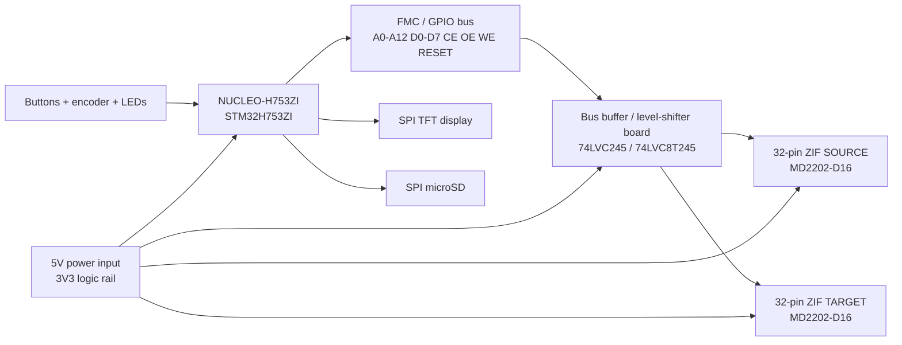

# NUCLEO-H753ZI wiring diagram

This is the wiring concept for the prototype adapter board. Exact STM32 pin assignment should be finalized in STM32CubeMX after checking the NUCLEO-H753ZI schematic and morpho header pinout.

## Bus wiring concept

| Signal group | NUCLEO-H753ZI side | Adapter board | SOURCE socket | TARGET socket | Notes |
|---|---|---|---|---|---|
| Address | FMC/GPIO A0-A12 | Buffered outputs | A0-A12 | A0-A12 | Shared address bus is acceptable if only one CE# is active. |
| Data | FMC/GPIO D0-D7 | Bidirectional transceiver | D0-D7 | D0-D7 | Direction controlled by read/write state. |
| Source select | GPIO/FMC NE pin | Source CE# driver | CE# | — | Keep inactive by default. |
| Target select | GPIO/FMC NE pin | Target CE# driver | — | CE# | Keep inactive by default. |
| Output enable | GPIO/FMC NOE | OE# buffer | OE# | OE# | Assert only during reads. |
| Write enable | GPIO/FMC NWE | WE# buffer | WE# | WE# | Firmware must never assert WE# on SOURCE during clone. |
| Reset | GPIO | RESET# buffer | RESET# | RESET# | Hold reset during power stabilization. |
| Power | 3V3 or verified VCC | fused/switched rail | VCC | VCC | Confirm exact MD2202 voltage before use. |
| Ground | GND | ground plane | GND | GND | Use common ground. |

## User interface wiring

| Function | Suggested interface | Notes |
|---|---|---|
| TFT display | SPI + DC + CS + RESET | Keep on separate CS from microSD. |
| microSD | SPI + CS | Used for source images and logs. |
| Encoder A/B/SW | GPIO inputs with pullups | Menu navigation. |
| READ button | GPIO input with pullup | Dump source to SD. |
| CLONE button | GPIO input with pullup | Source to target with verify. |
| VERIFY button | GPIO input with pullup | Compare source/target. |
| WRITE button | GPIO input with guarded confirmation | Restore image to target. |
| LEDs | GPIO outputs through resistors | Power, busy, pass, fail. |

## Critical safety defaults

- SOURCE WE# line should have a hardware jumper or cuttable trace that can physically disable writes to the source socket.
- TARGET WE# should remain pulled inactive until firmware explicitly enables write mode.
- Add pullups on CE#, OE#, WE#, and RESET# so devices remain safe during MCU reset.
- Do first bring-up without MD2202 chips installed.
