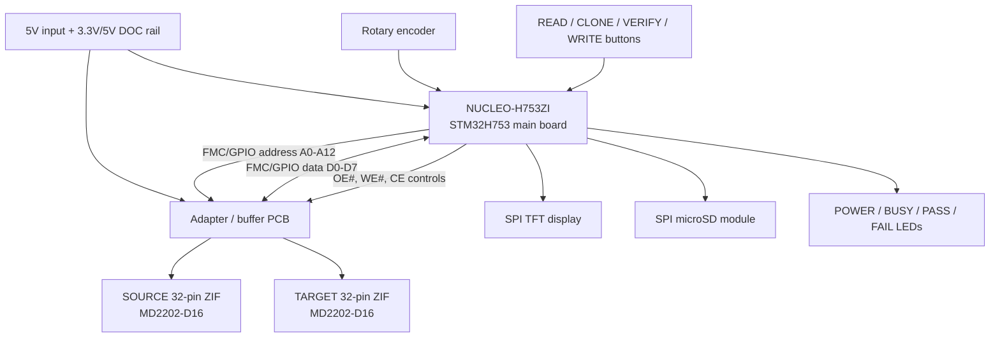
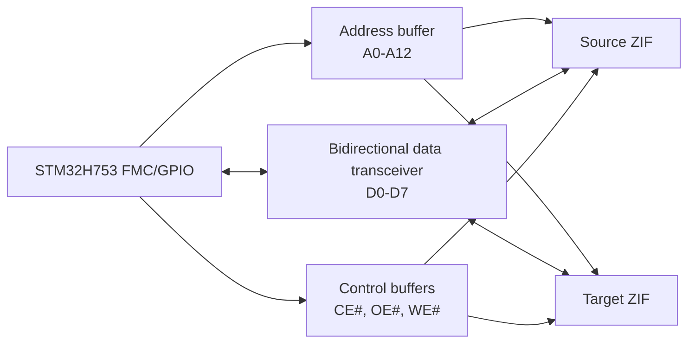

# MD2202-D16 cloner wiring and assembly diagram

This wiring plan is based on the DiskOnChip 2000 DIP datasheet uploaded in the design conversation.

## High-level wiring

## Adapter-board bus wiring

## Signal connection table

| Net | Source | Destination | Notes |
|---|---|---|---|
| A0-A12 | STM32 FMC/GPIO address bus | Both ZIF sockets pins A0-A12 | Use address buffer. Keep traces short and matched enough for clean edges. |
| D0-D7 | STM32 FMC/GPIO data bus | Both ZIF sockets pins D0-D7 | Use 74LVC245/SN74LVC8T245-style bidirectional transceiver. Direction = read/write. |
| OE# | STM32 read strobe / GPIO | Both sockets pin 24 | Active-low output enable. Pull high by default. |
| SOURCE_CE# | STM32 GPIO or decoded chip select | Source socket pin 22 | Active low. Pull high by default. |
| TARGET_CE# | STM32 GPIO or decoded chip select | Target socket pin 22 | Active low. Pull high by default. |
| SOURCE_WE# | Hardware pullup / write-protect jumper | Source socket pin 31 | Recommended: physically tie high through resistor; no normal firmware write path. |
| TARGET_WE# | STM32 write strobe through gate/buffer | Target socket pin 31 | Active low. Pull high by default. Gate behind write-enable latch/jumper. |
| VCC_DOC | Verified 3.3V or 5V rail | Both socket pin 32 | Select based on exact MD2202 marking/model. Do not guess. |
| GND | Ground | Both socket pin 16 | Common ground with NUCLEO and adapter PCB. |
| NC | — | Pins 1,2,3,28,29,30 | Leave floating. Do not use as tie points. |

## Decoupling and protection

Add at each ZIF socket, as close as possible to pin 32 and pin 16:

- 0.1 uF ceramic capacitor
- 10 nF low-inductance ceramic capacitor

Add pullups to keep inactive states safe during reset:

- CE# pullup: 10 kΩ to VCC_DOC
- OE# pullup: 10 kΩ to VCC_DOC
- WE# pullup: 4.7 kΩ to 10 kΩ to VCC_DOC

Add optional 22 Ω to 47 Ω series resistors on fast control lines if ringing appears on a logic analyzer.

## Physical assembly order

1. Print the enclosure bottom tray and top panel from `mechanical/enclosure`.
2. Install M3 heat-set inserts into the bottom-tray bosses.
3. Mount the NUCLEO-H753ZI to the bottom tray using M3 screws and nylon washers.
4. Mount the adapter/buffer PCB above or beside the Nucleo using the adapter-board standoffs.
5. Install the SOURCE and TARGET ZIF sockets on the adapter PCB.
6. Fit the top panel over the ZIF sockets to confirm the levers and chips are accessible through the top cutouts.
7. Mount the TFT display behind the display opening.
8. Install the rotary encoder, buttons, and LEDs through the top panel.
9. Wire the TFT, buttons, encoder, microSD, and LEDs to the Nucleo headers.
10. Connect the adapter PCB to the Nucleo using short ribbon cables or stacking headers.
11. With no MD2202 installed, power the unit and confirm all CE#, OE#, and WE# lines idle high.
12. Insert a sacrificial MD2202 into SOURCE only and test read-only identification.
13. Insert a sacrificial target and only then test target writes.

## Enclosure access points

- Top left ZIF: SOURCE chip insertion/removal.
- Top right ZIF: TARGET chip insertion/removal.
- Front display: operation menu and progress.
- Front buttons: READ, CLONE, VERIFY, WRITE.
- Rotary knob: menu navigation.
- Rear openings: USB/ST-LINK, optional power, microSD access, debug/UART.

## Safety rule

The SOURCE socket must be hardware write-protected. The safest prototype wiring is SOURCE_WE# permanently pulled high through a resistor, with no firmware-controlled path to pull it low.
