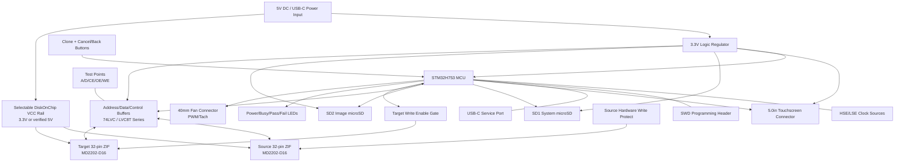

# Custom mainboard block diagram

## Bus philosophy

- Shared address bus to both sockets.
- Shared data bus through bidirectional transceiver.
- Separate CE# for source and target.
- SOURCE WE# physically held inactive except during special diagnostic mode that should not be populated by default.
- TARGET WE# gated through firmware-controlled and hardware-latched write-enable logic.

## Storage philosophy

- SD1 is system/config/log/update storage.
- SD2 is image/archive storage.
- Clone workflow always uses `SOURCE -> SD2 -> TARGET -> VERIFY`.
